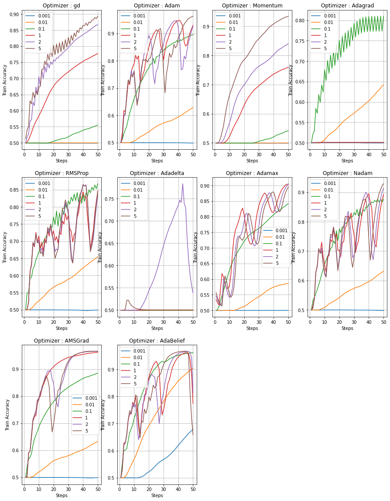
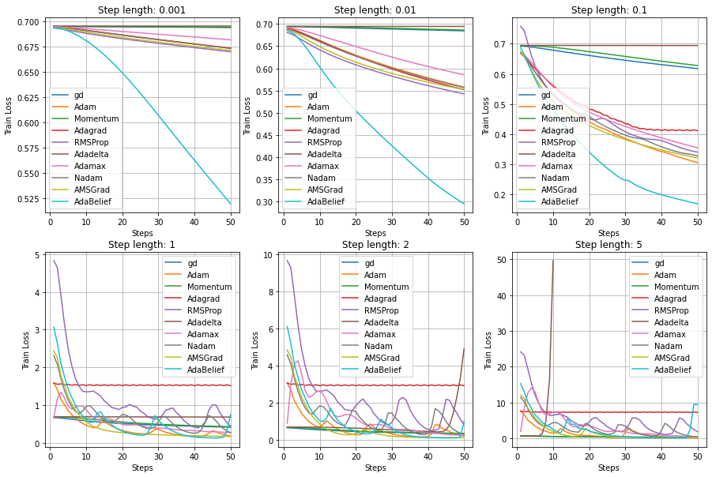
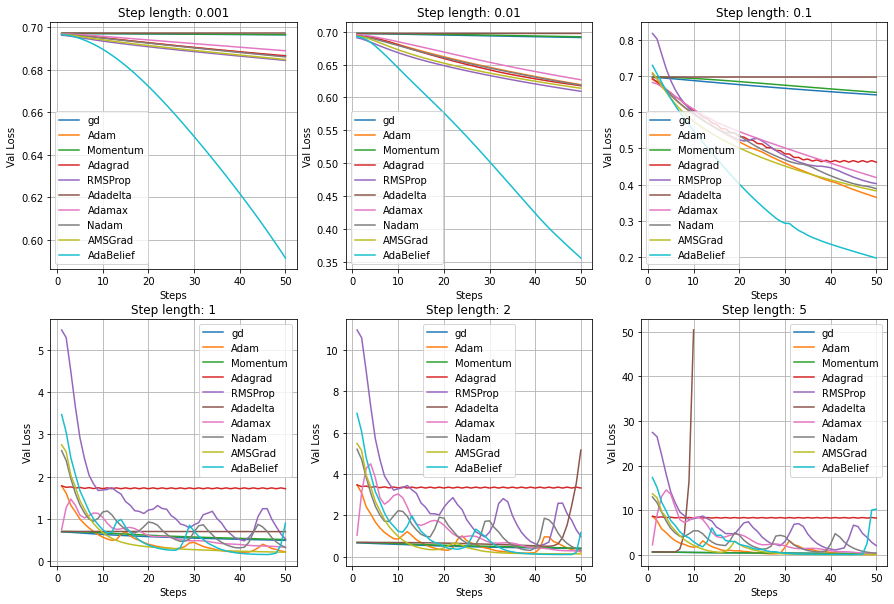
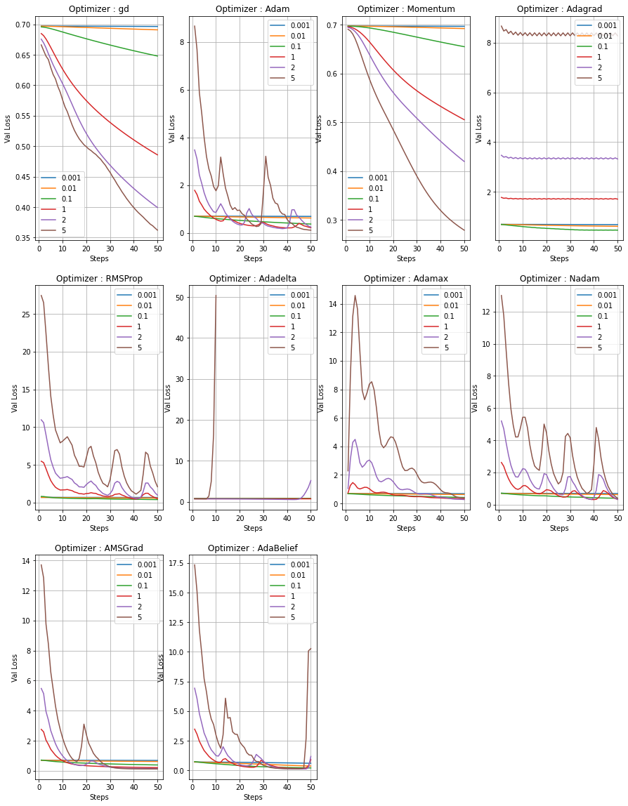
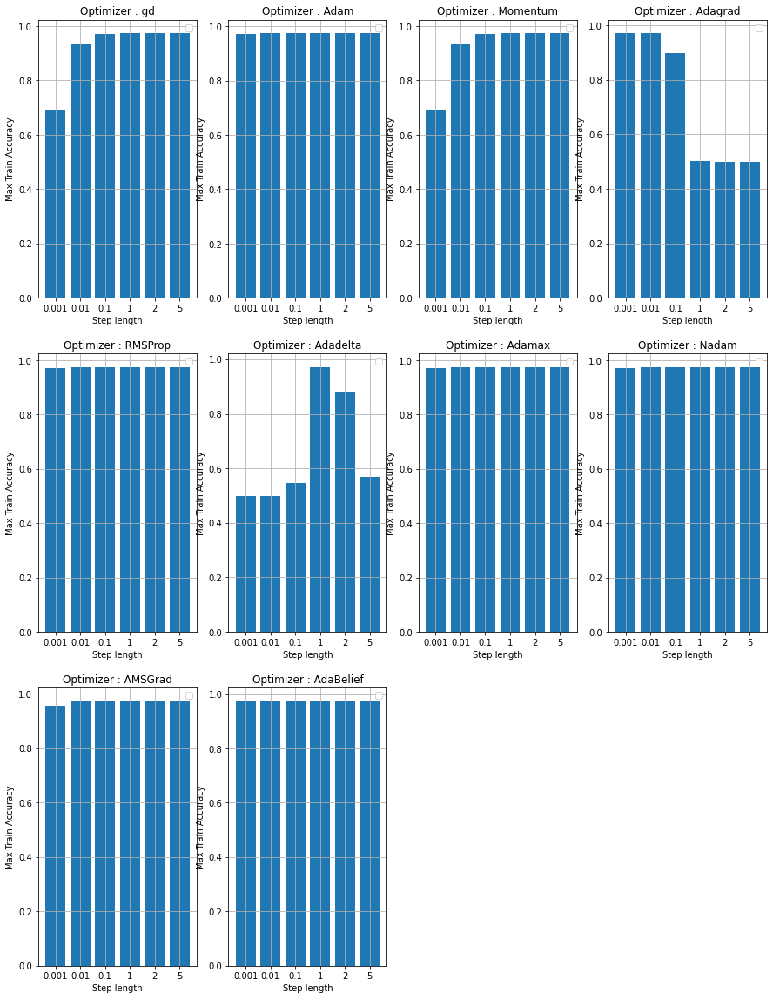
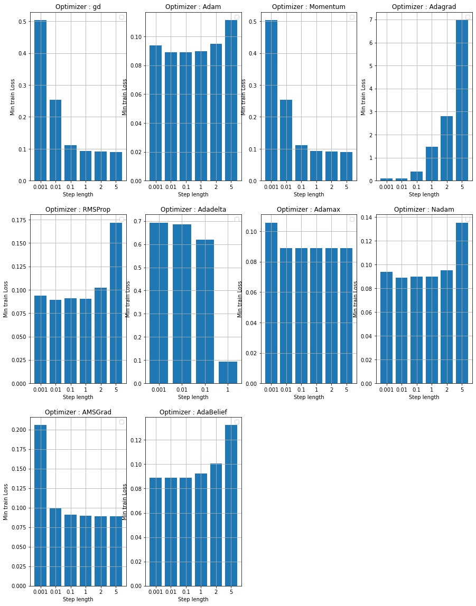
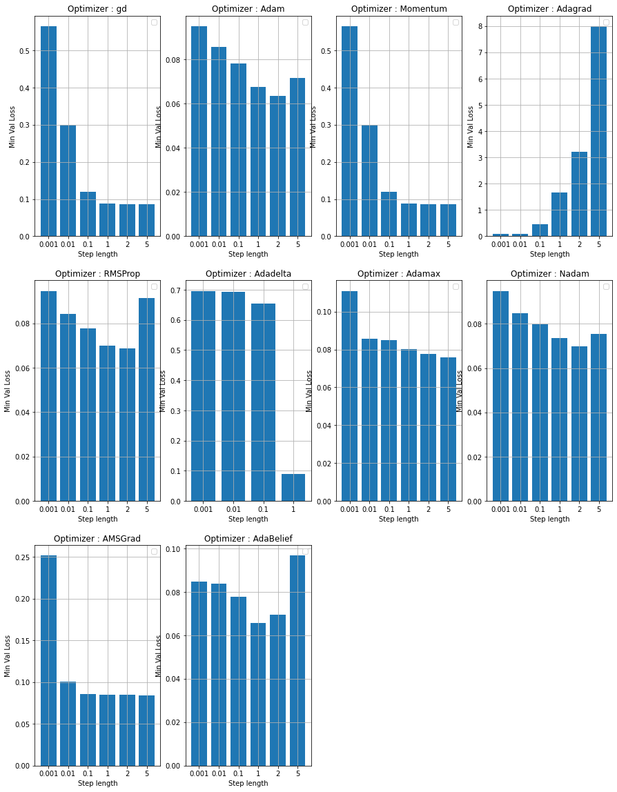
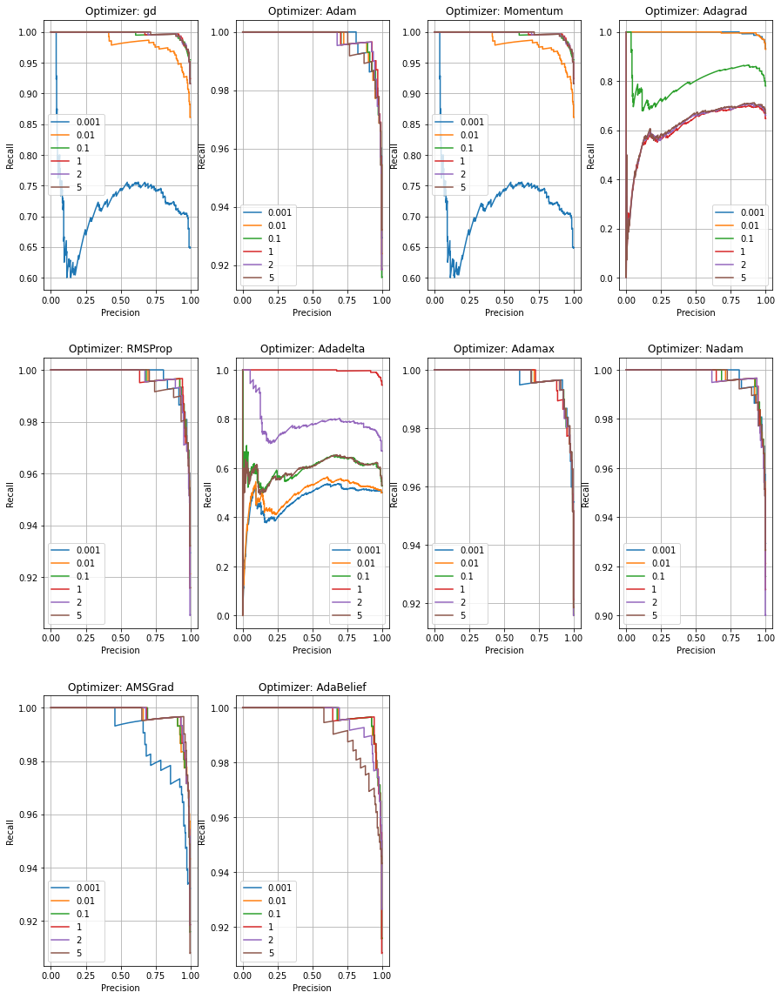

---
# try also 'default' to start simple
theme: seriph
# random image from a curated Unsplash collection by Anthony
# like them? see https://unsplash.com/collections/94734566/slidev
background:
# apply any windi css classes to the current slide
class: 'text-center'
position: 'center'
# https://sli.dev/custom/highlighters.html
highlighter: shiki
# show line numbers in code blocks
lineNumbers: false
# some information about the slides, markdown enabled
info: |
  ## Slidev Starter Template
  Presentation slides for developers.

  Learn more at [Sli.dev](https://sli.dev)
# persist drawings in exports and build
drawings:
  persist: true
---

# Môn học: Tối ưu hóa nâng cao
# Báo cáo bài tập 2
## Nhóm 5
## GVHD: TS. Hoàng Nam Dũng


## Thành viên: - Nguyễn Chí Thanh 
## - Nguyễn Đức Thịnh

<style>
h1 {
  background-color: #2B90B6;
  font-size: 12px;
  background-image: linear-gradient(45deg, #4EC5D4 10%, #146b8c 20%);
  background-size: 100%;
  -webkit-background-clip: text;
  -moz-background-clip: text;
  -webkit-text-fill-color: transparent;
  -moz-text-fill-color: transparent;
}
</style>

---


<style>
h1 {
  background-color: #2B90B6;
  background-image: linear-gradient(45deg, #4EC5D4 10%, #146b8c 20%);
  background-size: 100%;
  -webkit-background-clip: text;
  -moz-background-clip: text;
  -webkit-text-fill-color: transparent;
  -moz-text-fill-color: transparent;
  -font-size: 20px;
}
</style>

# MỤC LỤC

## 1. Thống kê mô tả và tiền xử lý dữ liệu
## 2. So sánh ba thuật toán Gradient Descent, Stochastic Gradient Descent và Batch Gradient Descent cho bài toán Logistic Regression với dữ liệu Voice Gender (So sánh ba thuật toán)
## 3. So sánh một số thuật toán tối ưu gradient bậc nhất

## 4. PHỤ LỤC

---

# 1. Thống kê mô tả và tiền xử lý dữ liệu

- Tập dữ liệu có 21 cột (đặc trưng) (tất cả đều là các biến định lượng)
- Tập dữ liệu có 3168 điểm dữ liệu
- 1584 điểm dữ liệu ứng với label male và female
- Không có điểm dữ liệu bị mất


Thống kê của từng cột

---

# 1. Thống kê mô tả và tiền xử lý dữ liệu


Phân phối của các đặc trưng

---

# 1. Thống kê mô tả và tiền xử lý dữ liệu


Phân phối của các đặc trưng theo label (nhãn giới tính)

---

# 1. Thống kê mô tả và tiền xử lý dữ liệu


Boxplot của các đặc trưng theo label (nhãn giới tính)

---

# 1. Thống kê mô tả và tiền xử lý dữ liệu


Correlation giữa các đặc trưng

---

# 1. Thống kê mô tả và tiền xử lý dữ liệu

- Tiền xử lý dữ liệu:

  - Loại bỏ cột centroid (giống hệt cột meanfreq)
  - Loại bỏ các cột có giá trị tuyệt đối tương quan với cột label nhỏ hơn 0.1 (Q75, skew, kurt, modindx)
  - Loại bỏ cột dfrange (có tương quan bằng 1 với cột maxdom)

  - Thêm cột ```pear_skew```:


  $$\mathrm{pearskew}=\dfrac{\mathrm{meanfreq} -  \mathrm{mode}}{\mathrm{sd}}$$

  - Min-max scaling:

  $$\mathrm{scaleX} = \dfrac{X - \min{X}}{\max{X} - \min{X}}$$

  - Dữ liệu được chia thành train và val theo Stratified Sampling với tỷ lệ 0.8 và 0.2

---

# 1. Thống kê mô tả và tiền xử lý dữ liệu

- Khởi tạo weights:
  - Sử dụng Xavier Initializer:

  $$w_i \sim \mathcal{N}(0, \dfrac{2}{n_{in} + n_{out}})$$

- Khởi tại bias:
  - Sử dụng zero initializer

---

# 2. So sánh ba thuật toán

- Hàm loss của Logistic Regression

$$f(w)=\dfrac{1}{n}\sum_{i=1}^n \Big( -y_i x_i^T w + \ln(1 + e^{x_i^T w}) \Big)$$

với $(x_i, y_i) \in \mathbb{R}^{k+1},i=1,2,\dots,n$ là cặp dữ liệu đầu vào và nhãn tương ứng và $w \in \mathbb{R}^k$

- Ta có $\mathrm{dom}(f(w)=\mathbb{R}^{k}$, là một tập lồi. Ta tính Gradient của $f(w)$ theo $w$:

$$\nabla f(w)=\dfrac{1}{n}\sum_{i=1}^n \Big( -y_i x_i + \dfrac{e^{x_i^Tw}}{1 + e^{x_i^T w}}x_i \Big)$$

---

# 2. So sánh ba thuật toán

- Ta tính ma trận Hessian của $f(w)$ theo $w$:

$$\nabla^2 f(x) = \dfrac{1}{n}\sum_{i=1}^n \dfrac{e^{x_i^Tw}(1 + e^{x_i^T w})-e^{2x_i^T w}}{(1 + e^{x_i^T w})^2}x_i x_i^T=\dfrac{1}{n}\sum_{i=1}^n \dfrac{e^{x_i^Tw}}{(1 + e^{x_i^T w})^2}x_i x_i^T$$

- Ta xét số hạng thứ $i$:

$$\dfrac{e^{x_i^Tw}}{(1 + e^{x_i^T w})^2}x_i x_i^T$$


---

# 2. So sánh ba thuật toán

- Ta xét ma trận Hessian $\nabla^2 f(x)$:

$$\dfrac{e^{x_i^Tw}}{(1 + e^{x_i^T w})^2}p^Tx_i x_i^T p=\Bigg(\sqrt{\dfrac{e^{x_i^Tw}}{(1 + e^{x_i^T w})^2}} x_i^Tp\Bigg)^T\Bigg(\sqrt{\dfrac{e^{x_i^Tw}}{(1 + e^{x_i^T w})^2}} x_i^Tp\Bigg)\geq 0 \thickspace \forall p \in \mathbb{R}^{k} \thickspace \forall x_i \in \mathbb{R}^{k}$$

$$\Rightarrow p^T \nabla^2 f(x)p=\dfrac{1}{n}\sum_{i=1}^n \dfrac{e^{x_i^Tw}}{(1 + e^{x_i^T w})^2}p^Tx_i x_i^T=\dfrac{1}{n}\sum_{i=1}^n \Bigg(\sqrt{\dfrac{e^{x_i^Tw}}{(1 + e^{x_i^T w})^2}} x_i^Tp\Bigg)^T\Bigg(\sqrt{\dfrac{e^{x_i^Tw}}{(1 + e^{x_i^T w})^2}} x_i^Tp\Bigg)\geq 0 \thickspace \forall p \in \mathbb{R}^{k} \thickspace \forall x_i \in \mathbb{R}^{k}$$

- Ta có $\mathrm{dom}(f(w))=\mathbb{R}^{k}$ là một tập lồi và $\nabla^2 f(x) \succeq 0$ nên $f(w)$ là hàm lồi

<style>
  .katex{font-size: 0.9em;}
</style>

---
layout: two-cols
---

# 2. So sánh ba thuật toán

- Fixed step sizes


::right::


---

# 2. So sánh ba thuật toán

- Fixed step sizes


---
layout: two-cols
---

# 2. So sánh ba thuật toán

- Fixed step size vs. Backtracking


::right::


---
layout: two-cols
---

# 2. So sánh ba thuật toán

- Fixed step size vs. Backtracking

Số steps cần thiết để đạt ngưỡng Loss < 0.5

- Fixed 0.01: 2084 steps
- Fixed 0.1: 209 steps
- Fixed 1: 21 steps
- Fixed 2: 12 steps
- Fixed 3: 20 steps
- Fixed 4: 33 steps
- Fixed 5: 37 steps
- Fixed 10: 35 steps


::right::

Số steps cần thiết để đạt ngưỡng Loss < 0.1

- Fixed 0.01: 20,000 steps mà vẫn chưa đạt được ngưỡng loss < 0.1 (loss sau 20,000 steps là: 0.2540252854003405)
- Fixed 0.1: 20,000 steps mà vẫn chưa đạt được ngưỡng loss < 0.1 (loss sau 20,000 steps là: 0.11094859289238355)
- Fixed 1: 4265 steps
- Fixed 2: 2132 steps
- Fixed 3: 1418 steps
- Fixed 4: 1052 steps
- Fixed 5: 822 steps
- Fixed 10: 204 steps 


---
layout: two-cols
---

# 2. So sánh ba thuật toán

- Fixed step size vs. Backtracking

Số steps cần thiết để đạt ngưỡng Loss < 0.5

- Backtracking (init_step_size = 1e-1): 209 outer steps, 209 steps total
- Backtracking (init_step_size = 10): 6 outer steps, 21 steps total
- Backtracking (init_step_size = 20): 6 outer steps, 28 steps total

::right::

Số steps cần thiết để đạt ngưỡng Loss < 0.1

- Backtracking (init_step_size = 1e-1): 20,000 steps mà vẫn chưa đạt được ngưỡng loss < 0.1 (loss sau 20,000 steps là: 0.11094859289238355)
- Backtracking (init_step_size = 10): 566 outer steps, 893 steps total
- Backtracking (init_step_size = 20): 518 outer steps, 1316 steps total

---

# 2. So sánh ba thuật toán

- GD vs. SGD vs. Mini Batch - By steps


---

# 2. So sánh ba thuật toán

- GD vs. SGD vs. Mini Batch – By time


---
layout: two-cols
---

# 2. So sánh ba thuật toán

- GD vs. SGD vs. Mini Batch – By Wolfe II Condition ratio & Goldstein Condtion ratio

Tỉ lệ số lượng step sizes (backtracking) thỏa mãn điều kiện Wolfe II:


::right::

Tỉ lệ số lượng step sizes (backtracking) thỏa mãn điều kiện Goldstein:


---
layout: two-cols
---

# 2. So sánh ba thuật toán

- GD vs. SGD vs. Mini Batch – By accuracy (Training data)


::right::


---
layout: two-cols
---

# 2. So sánh ba thuật toán

- GD vs. SGD vs. Mini Batch – By accuracy (Validating data)


::right::


---
layout: two-cols
---

# 2. So sánh ba thuật toán

- GD vs. SGD vs. Mini Batch – ROC Curve & P-R Curve


::right::


---
layout: two-cols
---

# 2. So sánh ba thuật toán

- So sánh với thư viện sklearn

Xét về giá trị tối thiểu của hàm loss:


::right::


---

# 3. So sánh một số thuật toán tối ưu gradient bậc nhất

- Một số thuật toán được sử dụng và so sánh:

  - Gradient Descent
  - Momentum
  - Adagrad
  - Adadelta
  - RMSProp
  - Adam
  - Adamax
  - AMSGrad
  - Nadam
  - AdaBelief

---

# 3. So sánh một số thuật toán tối ưu gradient bậc nhất

- Một số độ đo:

  - Loss
  - Accuracy
  - P-R Curve
  - ROC Curve

---

# 3. So sánh một số thuật toán tối ưu gradient bậc nhất


- 

Độ chính xác trên tập train (mỗi biểu đồ tương ứng với một step length, mỗi đường tương ứng với một thuật toán)

---

# 3. So sánh một số thuật toán tối ưu gradient bậc nhất


- 

Độ chính xác trên tập train (mỗi biểu đồ tương ứng với một thuật toán, mỗi đường tương ứng với một step length)


---

# 3. So sánh một số thuật toán tối ưu gradient bậc nhất


- 

Độ chính xác trên tập val (mỗi biểu đồ tương ứng với một step length, mỗi đường tương ứng với một thuật toán)


---

# 3. So sánh một số thuật toán tối ưu gradient bậc nhất


- 

Độ chính xác trên tập val (mỗi biểu đồ tương ứng với một thuật toán, mỗi đường tương ứng với một step length)


---

# 3. So sánh một số thuật toán tối ưu gradient bậc nhất


- 

Giá trị hàm loss trên tập train (mỗi biểu đồ tương ứng với một step length, mỗi đường tương ứng với một thuật toán)

---

# 3. So sánh một số thuật toán tối ưu gradient bậc nhất


- 

Giá trị hàm loss trên tập train (mỗi biểu đồ tương ứng với một thuật toán, mỗi đường tương ứng với một step length)

---

# 3. So sánh một số thuật toán tối ưu gradient bậc nhất


- 

Giá trị hàm loss trên tập val (mỗi biểu đồ tương ứng với một step length, mỗi đường tương ứng với một thuật toán)

---

# 3. So sánh một số thuật toán tối ưu gradient bậc nhất


- 

Giá trị hàm loss trên tập val (mỗi biểu đồ tương ứng với một thuật toán, mỗi đường tương ứng với một step length)

---

# 3. So sánh một số thuật toán tối ưu gradient bậc nhất

- 

Giá trị độ chính xác lớn nhất đạt được trên tập train (mỗi biểu đồ tương ứng với một thuật toán)

---

# 3. So sánh một số thuật toán tối ưu gradient bậc nhất

- 

Giá trị độ chính xác lớn nhất đạt được trên tập val (mỗi biểu đồ tương ứng với một thuật toán)

---

# 3. So sánh một số thuật toán tối ưu gradient bậc nhất

- 

Giá trị hàm loss nhỏ nhất đạt được trên tập train (mỗi biểu đồ tương ứng với một thuật toán)


---

# 3. So sánh một số thuật toán tối ưu gradient bậc nhất


- 

Giá trị hàm loss nhỏ nhất đạt được trên tập val (mỗi biểu đồ tương ứng với một thuật toán)

---

# 3. So sánh một số thuật toán tối ưu gradient bậc nhất

- 

- Precision - Recall curve (mỗi biểu đồ tương ứng với một step length)

---

# 3. So sánh một số thuật toán tối ưu gradient bậc nhất

- 

- Precision - Recall curve (mỗi biểu đồ tương ứng với một thuật toán)


---

# 3. So sánh một số thuật toán tối ưu gradient bậc nhất


- 

- ROC curve (mỗi biểu đồ tương ứng với một step length)

---

# 3. So sánh một số thuật toán tối ưu gradient bậc nhất

- 

- ROC curve (mỗi biểu đồ tương ứng với một thuật toán)


---

# 4. PHỤ LỤC

- Các công thức cập nhật tương ứng với các thuật toán:

## 4.1. Gradient Descent:

$$\begin{cases}g_t = \nabla f(w_{t-1}) \\ w_t = w_{t-1} - \alpha g_t\end{cases}$$

## 4.2. Momentum

$$\begin{cases}m_0 = 0 \\ g_t = \nabla f(w_{t-1}) 
\\ m_t = \beta_1 m_{t-1} + (1-\beta_1)g_t\\ w_t = w_{t-1} - \alpha m_t\end{cases}$$


---

# 4. PHỤ LỤC

## 4.3. Adagrad

$$\begin{cases}v_0 = 0\\ g_t = \nabla f(w_{t-1}) \\ v_t = v_{t-1} + g_t^2 \\ w_t = w_{t-1} - \alpha \dfrac{g_t}{\sqrt{v_t} + \epsilon} \end{cases}$$

---

# 4. PHỤ LỤC

## 4.4. Adadelta

$$\begin{cases}v_0 = 0\\d_0 = 0 \\ g_t = \nabla f(w_{t-1}) \\ v_t = \beta v_{t-1} + (1-\beta)g_t^2 \\ \Delta w = - \alpha \dfrac{\sqrt{d_{t-1} + \epsilon}g_t}{\sqrt{v_t + \epsilon}} \\ w_t = w_{t-1} + \Delta w \\ d_t = \beta d_{t-1} + (1 - \beta) \Delta w^2 \end{cases}$$


---

# 4. PHỤ LỤC

## 4.5. RMSProp

$$\begin{cases}v_0 = 0\\ g_t = \nabla f(w_{t-1}) \\ v_t = \beta v_{t-1} + (1-\beta)g_t^2 \\ w_t = w_{t-1} - \alpha \dfrac{g_t}{\sqrt{v_t} + \epsilon} \end{cases}$$

---

# 4. PHỤ LỤC

## 4.6. Adam

$$\begin{cases}m_0 = 0\\ v_0 = 0\\ g_t = \nabla f(w_{t-1}) \\ m_t = \beta_1 m_{t-1} + (1-\beta_2) g_t \\ v_t = \beta_2 v_{t-1} + (1-\beta_2)g_t^2 \\
\hat{m}_t = \dfrac{m_t}{1 - \beta_1^t} \\ \hat{v}_t = \dfrac{v_t}{1 - \beta_2^t} \\ w_t = w_{t-1} - \alpha \dfrac{\hat{m}_t}{\sqrt{\hat{v}_t} + \epsilon} \end{cases}$$

---

# 4. PHỤ LỤC

## 4.7. Adamax

$$\begin{cases}m_0 = 0\\ u_0 = 0 \\ g_t = \nabla f(w_{t-1}) \\ m_t = \beta_1 m_{t-1} + (1-\beta_2) g_t \\ u_t = \max(\beta_2 u_{t-1}, \lVert g_t \rVert_{\infty}) \\ w_t = w_{t-1} - \alpha \dfrac{m_t}{(1 - \beta_1^t)u_t + \epsilon}\end{cases}$$


---

# 4. PHỤ LỤC

## 4.8. AMSGrad

$$\begin{cases}m_0 = 0\\ v_0 = 0\\ g_t = \nabla f(w_{t-1}) \\ m_t = \beta_1 m_{t-1} + (1-\beta_2) g_t \\ v_t = \beta_2 v_{t-1} + (1-\beta_2)g_t^2 \\ \hat{v}_t = \max(\hat{v}_{t-1}, v_t) \\ w_t = w_{t-1} - \alpha \dfrac{m_t}{\sqrt{\hat{v}_t} + \epsilon} \end{cases}$$


---

# 4. PHỤ LỤC

## 4.9. Nadam

$$\begin{cases}m_0 = 0\\ v_0 = 0\\ g_t = \nabla f(w_{t-1}) \\ m_t = \beta_1 m_{t-1} + (1-\beta_2) g_t \\ v_t = \beta_2 v_{t-1} + (1-\beta_2)g_t^2 \\
\hat{m}_t = \dfrac{m_t}{1 - \beta_1^t} \\ \hat{v}_t = \dfrac{v_t}{1 - \beta_2^t} \\ w_t = w_{t-1} -  \dfrac{\alpha}{\sqrt{\hat{v}_t} + \epsilon}\Bigg(\beta_1\hat{m}_t + \dfrac{1-\beta_1}{1-\beta_1^t}g_t\Bigg) \end{cases}$$


---

# 4. PHỤ LỤC

## 4.10. AdaBelief

$$\begin{cases}m_0 = 0\\ s_0 = 0\\ g_t = \nabla f(w_{t-1}) \\ m_t = \beta_1 m_{t-1} + (1-\beta_2) g_t \\ s_t = \beta_2 s_{t-1} + (1-\beta_2)(g_t - m_t)^2 + \epsilon\\
\hat{m}_t = \dfrac{m_t}{1 - \beta_1^t} \\ \hat{s}_t = \dfrac{s_t}{1 - \beta_2^t} \\ w_t = w_{t-1} - \alpha \dfrac{\hat{m}_t}{\sqrt{\hat{s}_t} + \epsilon} \end{cases}$$

---

# 4. PHỤ LỤC

- [Link code](https://github.com/NguyenThanhAI/Advanced_Optimization_Exercises_2)

- [Link slide](https://github.com/NguyenThanhAI/Advanced_Optimization_Excercises_2_Slide)